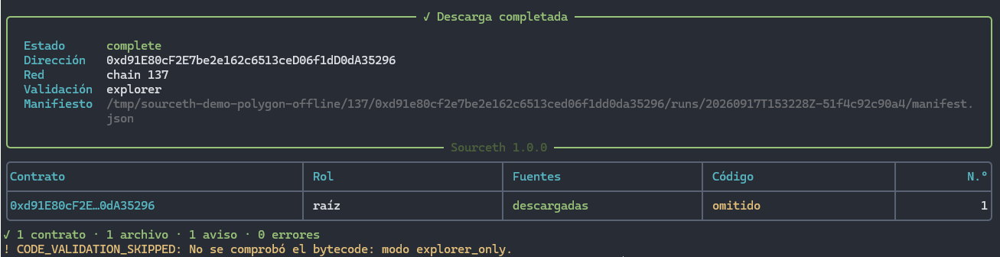

<div align="center">
  <div>░██████╗░█████╗░██╗░░░██╗██████╗░░█████╗░███████╗████████╗██╗░░██╗</div>
  <div>██╔════╝██╔══██╗██║░░░██║██╔══██╗██╔══██╗██╔════╝╚══██╔══╝██║░░██║</div>
  <div>╚█████╗░██║░░██║██║░░░██║██████╔╝██║░░╚═╝█████╗░░░░░██║░░░███████║</div>
  <div>░╚═══██╗██║░░██║██║░░░██║██╔══██╗██║░░██╗██╔══╝░░░░░██║░░░██╔══██║</div>
  <div>██████╔╝╚█████╔╝╚██████╔╝██║░░██║╚█████╔╝███████╗░░░██║░░░██║░░██║</div>
  <div>╚═════╝░░╚════╝░░╚═════╝░╚═╝░░╚═╝░╚════╝░╚══════╝░░░╚═╝░░░╚═╝░░╚═╝</div>
</div>

<br/>

<p align="center">
  <strong>🏮 Descarga segura y reproducible de fuentes verificadas de contratos EVM 🏮</strong><br>
</p>

<p align="center">
  <a href="https://github.com/Roger08G/sourceth/actions/workflows/ci.yml"></a>
  <a href="https://github.com/Roger08G/sourceth/releases"></a>
  <a href="https://github.com/Roger08G/sourceth/stargazers"></a>
  <a href="https://github.com/Roger08G/sourceth/network/members"></a>
  
  
  <a href="https://github.com/Roger08G/sourceth/blob/main/LICENSE"></a>
  <a href="https://github.com/Roger08G/sourceth/blob/main/.github/dependabot.yml"></a>
</p>

Sourceth es un CLI y una biblioteca Python que usa Foundry Cast para descargar las fuentes que un
explorador publica para **una dirección EVM por ejecución**. Valida la entrada, puede comprobar el
bytecode por RPC, sigue tres patrones de proxy estándar de forma opcional y crea revisiones locales
con hashes y procedencia.

> [!IMPORTANT]
> Sourceth no es un enumerador masivo, un framework de explotación, un decompilador ni un auditor.
> Una fuente descargada tampoco se presenta como el repositorio original ni como una prueba de
> recompilación idéntica del bytecode desplegado.



## Índice

- [Características](#características)
- [Requisitos](#requisitos)
- [Instalación](#instalación)
- [Configuración](#configuración)
- [Configuración TOML](#configuración-toml)
- [Uso](#uso)
- [API Python](#api-python)
- [Estructura de salida](#estructura-de-salida)
- [Proxies soportados](#proxies-soportados)
- [Estados y códigos de salida](#estados-y-códigos-de-salida)
- [Pruebas](#pruebas)
- [Seguridad y límites](#seguridad-y-límites)

## Características

| Área | Qué aporta |
| --- | --- |
| Descarga | Una dirección EVM por ejecución, con validación estricta de entrada. |
| Integridad | Runtime bytecode, bloque coherente, SHA-256, Keccak y manifiesto reproducible. |
| Proxies | Resolución opcional de EIP-1967, beacon EIP-1967 y ERC-1167. |
| Seguridad | Egress HTTPS restringido, entorno hijo mínimo, límites de tiempo y tamaño. |
| Repetibilidad | Caché, revisiones inmutables, puntero `latest.json` y almacenamiento atómico. |
| Automatización | JSON determinista, API Python tipada y CI para Python 3.12–3.14. |

## Requisitos

- Python 3.12, 3.13 o 3.14.
- [uv](https://docs.astral.sh/uv/).
- [Foundry Cast](https://getfoundry.sh/introduction/installation/) instalado por separado para las
  operaciones reales. La escritura de fuentes solo admite actualmente la build revisada 1.8.3,
  commit `cae51ad458f6abb64852b7709eb784352429825d`.
- Una API key de Etherscan en `ETHERSCAN_API_KEY`.
- Una URL RPC en `ETH_RPC_URL` para el modo `rpc`.

Sourceth no instala ni actualiza Foundry automáticamente.

## Instalación

Desde el checkout:

```bash
uv sync --all-groups --locked
uv run sourceth doctor
```

Para instalar solo la aplicación en un entorno gestionado por uv:

```bash
uv tool install .
sourceth doctor
```

`doctor` comprueba el binario, la versión, la interfaz necesaria y la presencia de configuración.
No hace llamadas de red salvo que se añada `--remote`.

## Configuración

### API key y RPC mediante `.env`

```bash
cp .env.example .env
```

```dotenv
ETHERSCAN_API_KEY=replace-with-your-etherscan-api-key
ETH_RPC_URL=https://your-ethereum-rpc.example/v1/replace-me
```

Sourceth lee exactamente `./.env` del directorio de invocación. No busca archivos en directorios
padre y rechaza un `.env` situado dentro del árbol de fuentes de una revisión descargada. Puede
elegirse otra ruta con `--env-file`. La precedencia es:

```text
CLI > entorno del proceso > .env > TOML > valores predeterminados
```

El entorno real tiene prioridad sobre `.env` y nunca es sobrescrito. `.env` está ignorado por Git.

Variables equivalentes sin archivo:

```bash
export ETHERSCAN_API_KEY='...'
export ETH_RPC_URL='https://...'
```

```powershell
$env:ETHERSCAN_API_KEY = '...'
$env:ETH_RPC_URL = 'https://...'
```

Los secretos se pasan a Cast mediante un entorno hijo reducido, no mediante argumentos. Esto evita
exposiciones accidentales en el historial o la lista de argumentos, pero no los oculta a un
administrador del sistema.

Para `cast source`, Sourceth levanta además una guardia CONNECT autenticada y efímera en loopback.
Cast solo puede abrir TLS hacia el origen exacto de `explorer_api_url`; una redirección a otro
origen se bloquea antes de entregar la API key. Esta frontera depende de la build exacta de Cast
revisada y no pretende proteger frente a un administrador local.

## Uso

```bash
sourceth fetch 0xe6cecf8b6593a7decf232bd2ccd444c4a09980b1 \
  --chain 1 \
  --output ./downloads
```

Descarga sin RPC, de forma explícita:

```bash
sourceth fetch 0xe6cecf8b6593a7decf232bd2ccd444c4a09980b1 \
  --chain 1 \
  --validation explorer
```

Resolver proxies soportados y emitir solo JSON por stdout:

```bash
sourceth fetch ADDRESS --chain 1 --follow-proxy --json
```

Opciones principales:

- `--chain`: chain ID EIP-155; Sourceth nunca lo deduce de la dirección.
- `--output`: almacén de revisiones.
- `--validation rpc|explorer`: `rpc` es el modo predeterminado.
- `--block`: `latest`, número o hash admitido por la versión comprobada de Cast.
- `--follow-proxy`: solo con RPC.
- `--max-depth`: límite de resolución, además del máximo de direcciones configurado.
- `--refresh`: fuerza una descarga nueva sin borrar revisiones anteriores.
- `--timeout`: timeout de la descarga en segundos.
- `--json`: reserva stdout para un único documento JSON; los logs van a stderr.
- `--verbose`: aumenta el detalle de logs, siempre con redacción.

La salida humana usa colores y tablas cuando se ejecuta en una terminal. Se desactiva
automáticamente al redirigir stdout y también puede deshabilitarse con `NO_COLOR=1`. El modo
`--json` nunca incluye códigos ANSI.

El modo `explorer` no es un fallback silencioso: registra `code_validation_status=skipped`, motivo
`explorer_only` y bloque `null`. En V1 es incompatible con `--block` y `--follow-proxy`.

## Configuración TOML

El archivo TOML solo se lee al indicarlo:

```bash
sourceth --config ./sourceth.toml fetch ADDRESS --chain 1
```

Consulta [`sourceth.example.toml`](sourceth.example.toml). Solo Ethereum mainnet está registrada de
serie. Una red adicional debe declararse explícitamente:

```toml
[networks."137"]
name = "polygon-mainnet"
provider = "etherscan"
explorer_api_url = "https://api.etherscan.io/v2/api"
explorer_url = "https://polygonscan.com"
```

Los endpoints HTTPS son obligatorios para redes adicionales y no pueden contener credenciales,
query ni fragmento. Sourceth los pasa explícitamente a Cast desde un entorno hijo controlado;
no acepta que un `.env` descubierto por Foundry cambie el explorador. Registrar una red no
garantiza que el proveedor o el plan de API la soporten.

## API Python

```python
from pathlib import Path

from src import DownloadRequest, SourceDownloader, load_config

config = load_config(dotenv_path=Path(".env"))
downloader = SourceDownloader(config)
request = DownloadRequest(
    address="0xe6cecf8b6593a7decf232bd2ccd444c4a09980b1",
    chain_id=1,
    output_dir=Path("downloads"),
    validation="rpc",
    follow_proxy=False,
)
result = downloader.fetch(request)
print(result.status.value, result.manifest_path)
```

`SourceDownloader` permite inyectar el runner, el adaptador Cast, el resolvedor y el almacén para
pruebas completamente offline. La biblioteca devuelve modelos o lanza excepciones tipadas; no
devuelve códigos de salida de proceso.

## Estructura de salida

```text
downloads/
├── .sourceth/
│   ├── cache/k-HASH/...
│   ├── locks/...
│   └── staging/...
└── CHAIN_ID/ROOT_ADDRESS/
    ├── latest.json
    └── runs/RUN_ID/
        ├── manifest.json
        └── contracts/ADDRESS/
            ├── runtime-bytecode.hex
            └── sources/...
```

Cada `--refresh` crea otro `RUN_ID`. `latest.json` distingue la ejecución más reciente de la
última completa, por lo que un resultado parcial no suplanta silenciosamente uno completo.

El manifiesto registra versión de Sourceth y Cast, entrada, red, bloque, contratos y relaciones,
Keccak del runtime, SHA-256 y tamaño de cada archivo, reutilización de caché, intentos, duraciones,
advertencias y errores saneados. La recompilación independiente siempre figura como
`not_performed`.

## Proxies soportados

- Slot de implementación EIP-1967.
- Slot beacon EIP-1967 y lectura `implementation()`.
- Runtime canónico ERC-1167.

Se aplican profundidad máxima, máximo de direcciones, deduplicación y ciclos. Las direcciones se
descargan en carpetas separadas. Un slot compatible se registra como evidencia de candidato: no se
deduce Transparent frente a UUPS y no se buscan diamonds, proxies personalizados o clones por
heurísticas vagas. La ausencia de un patrón soportado se informa como
`no_supported_pattern_detected`, no como `not_a_proxy`.

## Estados y códigos de salida

Estados globales:

- `complete`: completo para el alcance solicitado.
- `partial`: se recuperó una parte, pero otra falló o alcanzó un límite.
- `failed`: no se obtuvo un resultado utilizable.

Cada contrato mantiene estados separados para fuentes, código y proxy.

| Código | Significado |
|---:|---|
| 0 | Resultado completo |
| 2 | Argumentos o configuración inválidos |
| 3 | Resultado parcial |
| 4 | Operación fallida |
| 130 | Interrupción del usuario |

Los errores tienen códigos estables como `INVALID_ADDRESS`, `CAST_NOT_FOUND`, `CHAIN_MISMATCH`,
`SOURCE_NOT_VERIFIED`, `RATE_LIMITED`, `UNSAFE_OUTPUT` y `PROXY_LIMIT_REACHED`.

## Pruebas

Suite normal, sin Internet, Foundry ni secretos:

```bash
uv run ruff check .
uv run ruff format --check .
uv run mypy src tests
uv run pytest -m "not real" --cov=src --cov-report=term-missing
```

Pruebas reales opt-in:

```bash
SOURCETH_RUN_REAL=1 uv run pytest -m real -vv
```

En PowerShell:

```powershell
$env:SOURCETH_RUN_REAL = '1'
uv run pytest -m real -vv
```

Si falta Cast, la API key o RPC, las pruebas reales se marcan `SKIPPED`; nunca se presentan como
superadas. Un Cast simulado valida integración de procesos y archivos, no una descarga de mainnet.

La interfaz local se contrastó offline con el artefacto oficial de Cast 1.8.3: `cast --version`,
`cast source --help` y `cast rpc --help`. No se proporcionaron credenciales reales ni se ejecutó
una descarga contra mainnet; la prueba `real` sigue siendo deliberadamente opt-in.

## Seguridad y límites

La salida de `cast source -d` se escribe antes de que Python pueda inspeccionarla. La implementación
oficial revisada no garantiza contención de prefijos absolutos de Windows, por lo que Sourceth
bloquea esa descarga nativa en Windows. Ejecútala dentro de Linux/WSL o de un contenedor con el
directorio de salida como único volumen escribible. Consulta
[`docs/security-and-limitations.md`](docs/security-and-limitations.md).

En Windows también se rechaza antes de publicar cualquier revisión cuya ruta final alcance el
límite portable de 260 caracteres. No se publica un árbol que luego resulte inaccesible para
herramientas sin soporte de rutas extendidas.

La validación RPC demuestra existencia de bytecode en un bloque coherente. No demuestra que las
fuentes recompilen a ese bytecode. `--block` tampoco hace histórica la respuesta del explorador.
Las lecturas prefieren EIP-1898 por hash; si el nodo no lo soporta de forma inequívoca, usan el
número fijado y comprueban de nuevo su hash antes de publicar.

Más detalle en [`docs/architecture.md`](docs/architecture.md).

## Licencia

[MIT](https://github.com/Roger08G/sourceth/blob/main/LICENSE)
